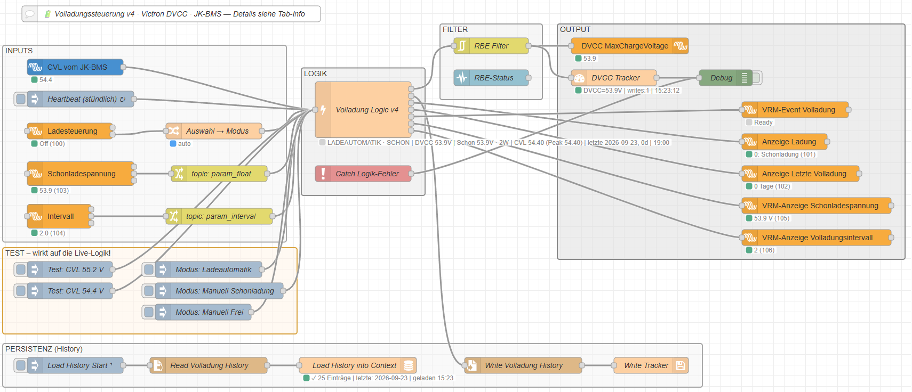
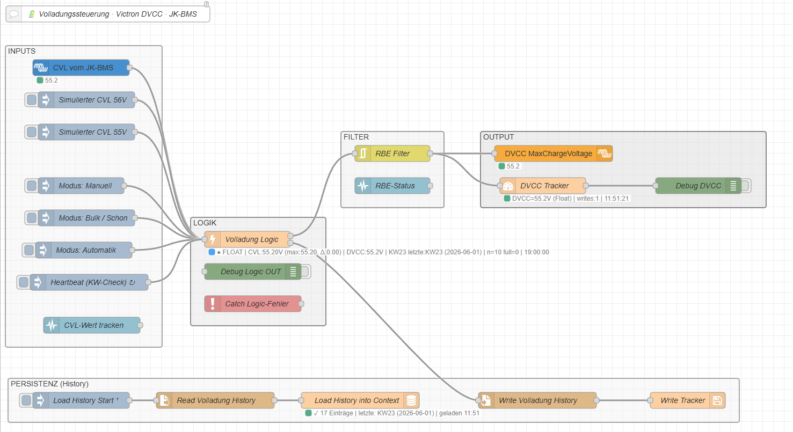
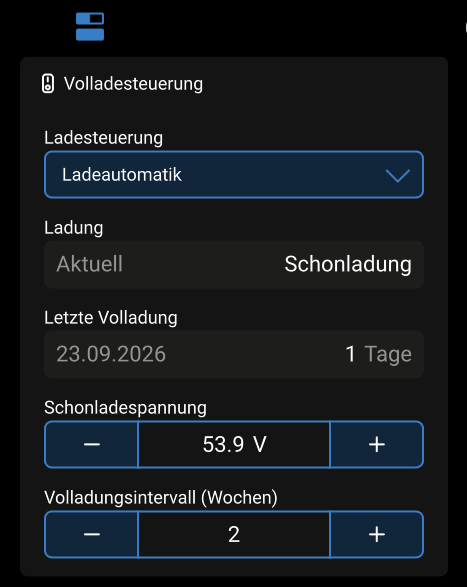
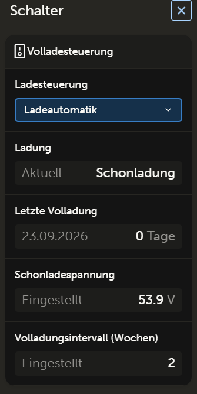

# Victron Node-RED — Charge Control for LiFePO4

> Intelligent LiFePO4 charge management for Victron systems via DVCC and Node-RED.



---

## What it does

This flow introduces a time-based strategy that standard systems do not offer: a configurable full charge interval (in calendar weeks) for balancing, and a lower conservation voltage for all remaining days. How beneficial this is depends on your system and preferences — the flow simply makes it possible.

Full charge detection is CVL-based: the JK-BMS lowers its CVL once the battery is full. The flow detects this drop (≥ `DELTA_V`) and records the event in a persistent history file. Detection runs whenever **Free** is active (DVCC = 0 V, BMS controls), regardless of the selected mode.

---

## How it works

```
JK-BMS CVL  ──►  Full Charge Logic  ──►  DVCC MaxChargeVoltage  ──►  Victron GX
                  ↑ Heartbeat (1×/h)
                  ↑ Mode (GX virtual switch)
                  ↑ Conservation voltage (GX virtual switch)
                  ↑ Interval in weeks (GX virtual switch)
```

1. The JK-BMS continuously broadcasts its Charge Voltage Limit (CVL) via D-Bus.
2. When CVL drops by ≥ `DELTA_V` (0.5 V) while DVCC = 0 V, the logic detects a completed full charge.
3. The event is recorded in the history file and DVCC switches back to the conservation voltage.
4. A heartbeat re-evaluates the DVCC setting every hour (e.g. on calendar week change).

---

## Operating Modes

Selected via the **Charge Control** dropdown on the GX / in VRM:

| Mode | DVCC | Behaviour |
|------|------|-----------|
| **Auto Charge** | Logic decides | Conservation charge until the interval has elapsed, then Free until the BMS confirms full charge via CVL drop |
| **Manual Conservation** | Conservation voltage | Permanent conservation charge; logic never switches automatically |
| **Manual Free** | 0 V (BMS controls) | Permanent free mode; every CVL drop is recorded as `manual` and resets the auto interval |

---

## Parameters

Adjustable live on the GX / Local UI (`http://<IP-GX>/gui-v2/`, group **Full Charge Control**), persisted across restarts. Read-only monitoring of configured values is available remotely via VRM and the Remote Console:

| Parameter | Default | Range | Description |
|-----------|---------|-------|-------------|
| Conservation Voltage | `53.9 V` | 52.0–54.4 V, step 0.1 V | DVCC voltage during conservation charge |
| Full Charge Interval (Weeks) | `2` | 1–8 calendar weeks | Minimum interval between full charges |

Fixed in the logic node:

| Parameter | Value | Description |
|-----------|-------|-------------|
| `DELTA_V` | `0.5 V` | CVL drop that signals a completed full charge |

---

## Requirements

- Victron GX device (Venus OS **v3.80** or later)
- Node-RED with [node-red-contrib-victron](https://github.com/victronenergy/node-red-contrib-victron) **v1.7.27** or later
- JK-BMS connected via D-Bus (battery service `com.victronenergy.battery/512`)
- DVCC enabled in Venus OS

---

## Installation

1. Download [`flow/ChargeControl_German.json`](charge-control/flow/ChargeControl_German.json) or [`flow/ChargeControl_English.json`](charge-control/flow/ChargeControl_English.json).
2. In Node-RED: **Menu → Import → select file**.
3. Deploy.
4. Set conservation voltage and interval via the **Full Charge Control** group on the GX or in VRM.

The history file is created automatically at:
`/data/home/nodered/.node-red/history/volladung_history.json`

---

## Screenshots

**Flow overview**



**Local GUI — full control** (`http://<IP-GX>/gui-v2/`)



**VRM / Remote Console — read-only monitoring**



---

## Tested with

Victron Multiplus-II GX · JK-BMS PB2A16S20P · Venus OS v3.80 · node-red-contrib-victron v1.7.27

---

MIT License
